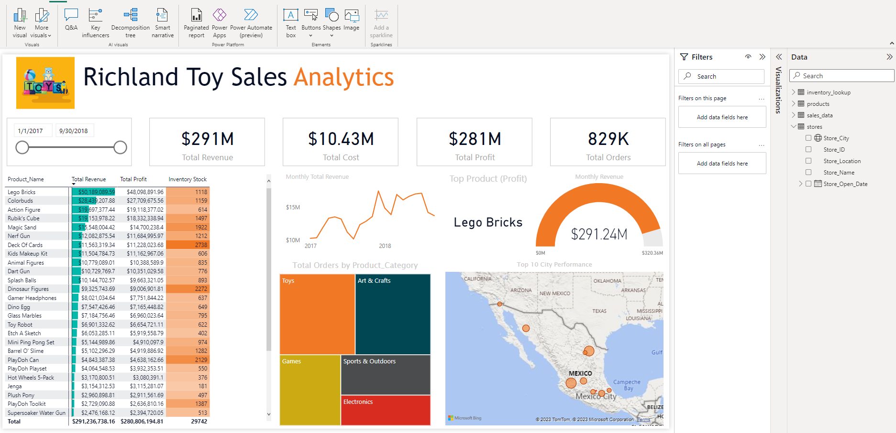

# Richland_Toy_Sales_Market

## Introduction

This is an end-to-end BI Project on sales analysis of a fictituous Toy stores in Mexico **Richland Toys Stores**. The project aims to analyze and derive actionable insights that'll help stakeholders make business decions that will drive growth.

## Problem Statement

1. What are the top 5 products that drive most profits?
2.  which city generated the hihest profit from 2017 to 2018?
3.  What was the total revenue pattern in the first half of the year?

## Skills/Concepts Demonstrated:

The following Power BI features were incorporated:
- Bookmarking
- Filter
- Tooltips
- Page Navigation
- Data Analysis Expression (DAX)

## Visualization
The report comprises 2 pages:
1.  Excecutive Summary
2.  Actionable Insights 

This is the preview of the dashboard:

You can interact with the report here (https://1drv.ms/u/s!ArikmP7m-jOFdHgLKqIR6oLiW-A?e=dgQadS)

## Insights:
- The total revenue decreased by 20%  between July to September 2018.
- The highest profit of over $22 million was generated in Guadalajara.
- In the first half of the year 2017, the total revenue increased by over 30% and the top 5 products are Lego Bricks,    Colorbuds, Action Figures, Rubik's Cube & Kids' Make-up kits.
